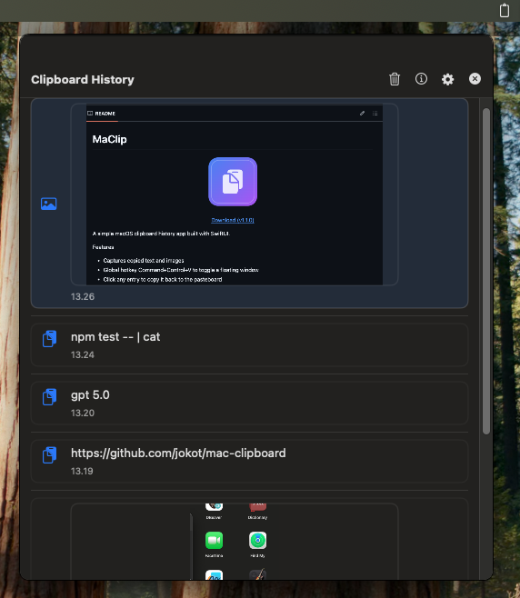

MaClip
================

<p align="center">
  
</p>

<p align="center">
  <a href="https://github.com/jokot/mac-clipboard/releases/tag/v1.1.0">Download (v1.1.0)</a>
  
</p>

<p align="center">
  
</p>

<p align="center">
  <video src="assets/macclip-demo.mov" width="800" controls loop muted playsinline></video>
  <br/>
  <a href="assets/macclip-demo.mov">Demo video (MOV)</a>
</p>

A simple macOS clipboard history app built with SwiftUI.

Features
- Captures copied text and images
- Global hotkey Command+Control+V to toggle a floating window
- Click any entry to copy it back to the pasteboard

Build & Run
1. Ensure you have Xcode and Homebrew installed.
2. Install XcodeGen if needed and generate the Xcode project:

   ```bash
   brew list xcodegen >/dev/null 2>&1 || brew install xcodegen
   xcodegen generate
   open MacClipboard.xcodeproj
   ```

3. Select the "MacClipboard" scheme and run. (Display name appears as "MaClip".)

Notes
- The app uses Carbon's RegisterEventHotKey API, so no special permissions are required for the global hotkey.
- The app is not sandboxed and is intended for personal use/development. For Mac App Store distribution, additional work is required.

Local release (DMG + checksum)
--------------------------------
To package a DMG and generate a SHA256 checksum for sharing (e.g., on GitHub Releases):

```bash
# 1) Build Release into ./build
xcodebuild -scheme MacClipboard -project MacClipboard.xcodeproj -configuration Release BUILD_DIR=$(pwd)/build clean build

# 2) Package DMG with create-dmg + checksum (opens/mounts briefly)
brew list create-dmg >/dev/null 2>&1 || brew install create-dmg
VERSION=$(defaults read "$(pwd)/build/Release/MaClip.app/Contents/Info" CFBundleShortVersionString)
rm -f dist/MacClip-${VERSION}.dmg dist/MacClip-${VERSION}.dmg.sha256
create-dmg --volname "MaClip" --volicon "App/AppIcon.icns" \
  --window-pos 200 120 --window-size 540 360 --icon-size 96 --text-size 12 \
  --icon "MaClip.app" 140 150 --app-drop-link 400 150 --format UDZO \
  "dist/MacClip-${VERSION}.dmg" "build/Release/MaClip.app"
shasum -a 256 "dist/MacClip-${VERSION}.dmg" > "dist/MacClip-${VERSION}.dmg.sha256"
```

Notes:
- The DMG window will open briefly during creation; this is expected. The `--app-drop-link` adds the standard Applications shortcut for drag‑to‑install.

Notes:
- Bump the app version before building so `VERSION` updates.
- Unsigned binaries may trigger Gatekeeper on other Macs. For wide distribution, sign and notarize.

Verify checksum
----------------
Once you have a DMG and its `.sha256` file:

```bash
# Verify the DMG against the stored checksum
shasum -a 256 -c dist/MacClip-*.dmg.sha256

# Recompute and print the hash
shasum -a 256 dist/MacClip-*.dmg

# Show the stored hash
cat dist/MacClip-*.dmg.sha256
```

