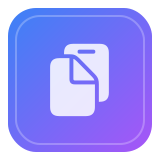

MaClip
================

<p align="center">
  
</p>

A simple macOS clipboard history app built with SwiftUI.

## Download

- [Download v1.3.0](https://github.com/jokot/mac-clipboard/releases/tag/v1.3.0)

## Preview


### Copy Clipboard Demo
https://github.com/user-attachments/assets/bf1e34b1-2c07-476c-a4a6-a8ed99fd22e8

## Features
- Captures copied text and images
- Global hotkey Command+Control+V to toggle a floating window
- Click any entry to copy it back to the pasteboard
- Search clipboard history (text)
- Quit from overlay header or menu bar icon
- Command+, opens Settings when overlay is visible; Settings also available in menu bar
- Theme selection: System / Light / Dark (via Settings)
- Customizable global hotkey (changeable in Settings)
- Keyboard navigation in overlay: ↑/↓ to move, Return to select, Esc to close
- Status bar menu: quick access to Show Clipboard, Settings, and Quit
- About/Info window with version details and GitHub link
- Clear All History action
- Persistent clipboard history on disk (JSON metadata + image files), async saving, and auto-save on changes and on quit

## Usage

1. Press <kbd>CONTROL (⌃)</kbd> + <kbd>COMMAND (⌘)</kbd> + <kbd>V</kbd> to show the MaClip overlay, or click the menu bar icon.
2. Type in the Search field to filter your clipboard history.
3. Select an item to copy it back to the clipboard:
   - Press <kbd>ENTER</kbd> to copy the highlighted item and close the overlay.
   - Click an item to copy it and close the overlay.
4. Navigate the list with <kbd>↑</kbd>/<kbd>↓</kbd> arrow keys.
5. Press <kbd>ESC</kbd> to close the overlay.
6. Remove a single item: hover over it and click the trash button.
7. Clear all history: click the trash button in the header and confirm.
8. Open Settings: press <kbd>COMMAND (⌘)</kbd> + <kbd>,</kbd> while the overlay is visible, or choose "Settings…" from the menu bar icon.
9. Customize behavior in Settings: change the global hotkey, switch theme (System/Light/Dark), and adjust storage limits.
10. Open About: click the info button in the overlay header to view version details and a GitHub link.

## Build from source
1. Ensure you have Xcode and Homebrew installed.
2. Install XcodeGen if needed and generate the Xcode project:

   ```bash
   brew list xcodegen >/dev/null 2>&1 || brew install xcodegen
   xcodegen generate
   open MacClipboard.xcodeproj
   ```

3. Select the "MacClipboard" scheme and run. (Display name appears as "MaClip".)

## Data Persistence

MaClip implements comprehensive persistence for both text and image clipboard entries:

### Storage Location
- **Base directory**: `~/Library/Application Support/MaClip/`
- **Metadata**: `history.json` stores clipboard entry references and metadata
- **Images**: PNG files stored in `Images/` subdirectory, named by UUID (e.g., `{uuid}.png`)

### Data Model
Each clipboard entry (`ClipboardItem`) contains:
- `id`: Unique UUID identifier
- `date`: Timestamp when copied
- `content`: Either `.text(String)` or `.image(NSImage)`

### Persistence Workflow
- **Saving**: Items are converted to JSON records with image references. Images are saved as PNG files separately.
- **Loading**: At startup, metadata is read from JSON and images are reconstructed from PNG files. Missing image files are gracefully skipped.
- **Timing**: Data is saved synchronously on app termination and asynchronously on list changes (new items, promotions, deletions, etc.).

### Data Management
- **Deduplication**: Prevents duplicate entries by comparing text strings or PNG data bytes
- **Retention**: Configurable max items limit with automatic truncation
- **Auto-cleanup**: Removes items older than 7 days during new item insertion
- **Atomic writes**: Reduces risk of corrupted files during save operations

*Implementation files: `ClipboardRepository.swift`, `ClipboardItem.swift`, `ClipboardListViewModel.swift`, `ClipboardMonitor.swift`*

## Notes
- The app uses Carbon's RegisterEventHotKey API, so no special permissions are required for the global hotkey.
- The app is not sandboxed and is intended for personal use/development. For Mac App Store distribution, additional work is required.

## Packaging (DMG + checksum)
To package a DMG and generate a SHA256 checksum for sharing (e.g., on GitHub Releases):

```bash
# 1) Build Release into ./build
xcodebuild -scheme MacClipboard -project MacClipboard.xcodeproj -configuration Release BUILD_DIR=$(pwd)/build clean build

# 2) Package DMG with create-dmg + checksum (opens/mounts briefly)
brew list create-dmg >/dev/null 2>&1 || brew install create-dmg
VERSION=$(defaults read "$(pwd)/build/Release/MaClip.app/Contents/Info" CFBundleShortVersionString)
rm -f dist/MacClip-${VERSION}.dmg dist/MacClip-${VERSION}.dmg.sha256
create-dmg --volname "MaClip" --volicon "App/AppIcon.icns" \
  --window-pos 200 120 --window-size 540 360 --icon-size 96 --text-size 12 \
  --icon "MaClip.app" 140 150 --app-drop-link 400 150 --format UDZO \
  "dist/MacClip-${VERSION}.dmg" "build/Release/MaClip.app"
shasum -a 256 "dist/MacClip-${VERSION}.dmg" > "dist/MacClip-${VERSION}.dmg.sha256"
```

### Packaging notes
- The DMG window will open briefly during creation; this is expected. The `--app-drop-link` adds the standard Applications shortcut for drag‑to‑install.
- Bump the app version before building so `VERSION` updates.
- Unsigned binaries may trigger Gatekeeper on other Macs. For wide distribution, sign and notarize.

### Verify checksum
Once you have a DMG and its `.sha256` file:

```bash
# Verify the DMG against the stored checksum
shasum -a 256 -c dist/MacClip-*.dmg.sha256

# Recompute and print the hash
shasum -a 256 dist/MacClip-*.dmg

# Show the stored hash
cat dist/MacClip-*.dmg.sha256
```


## License
MIT License. See `LICENSE` for details.
